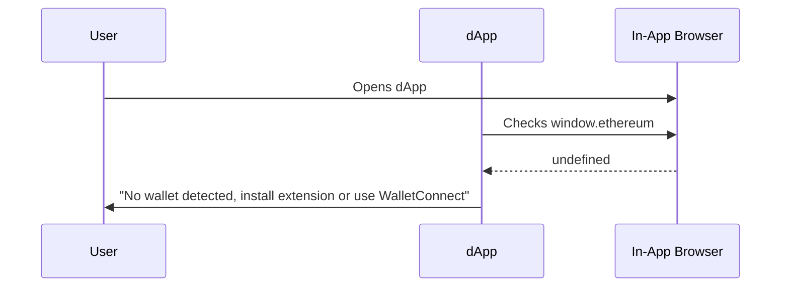
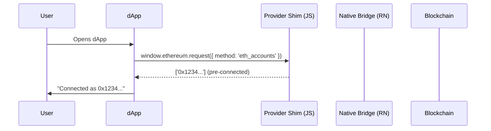
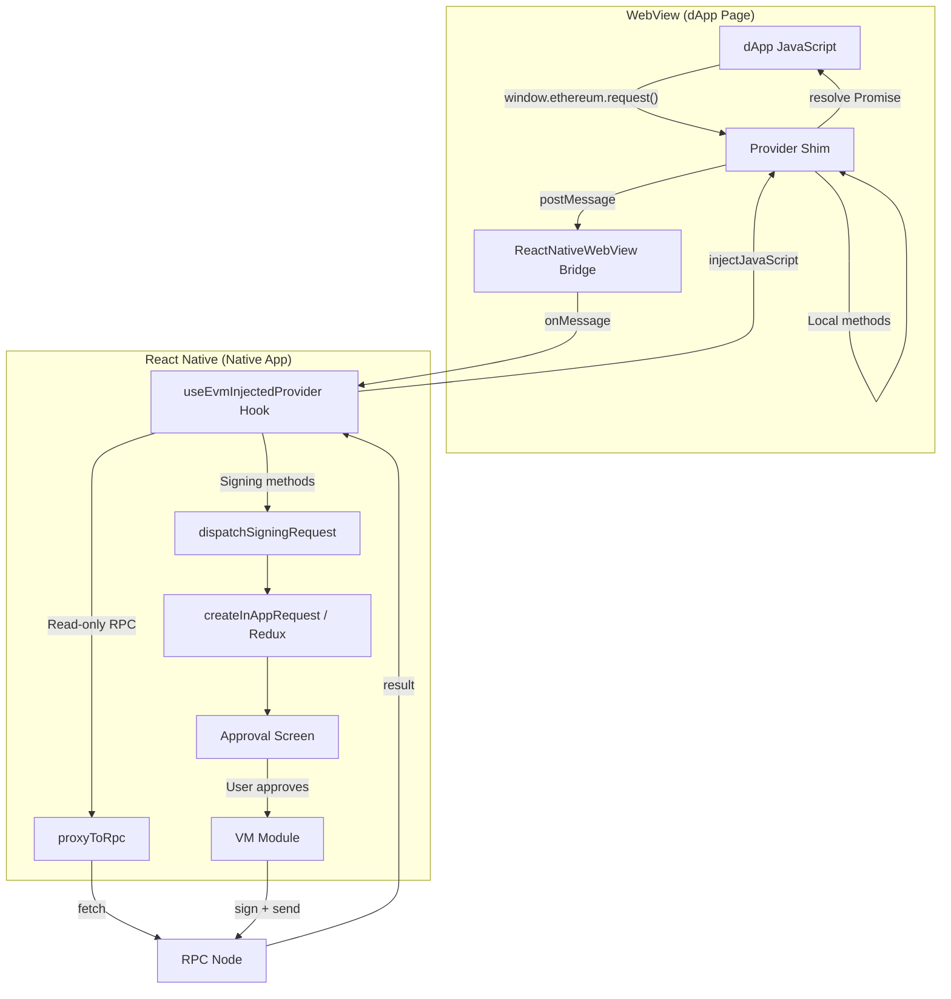
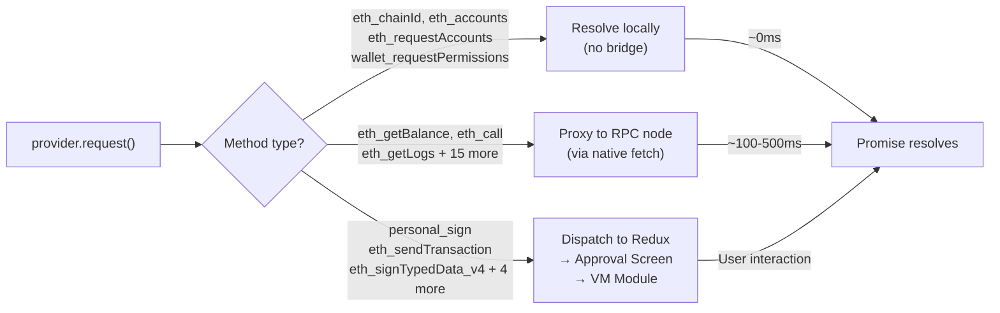
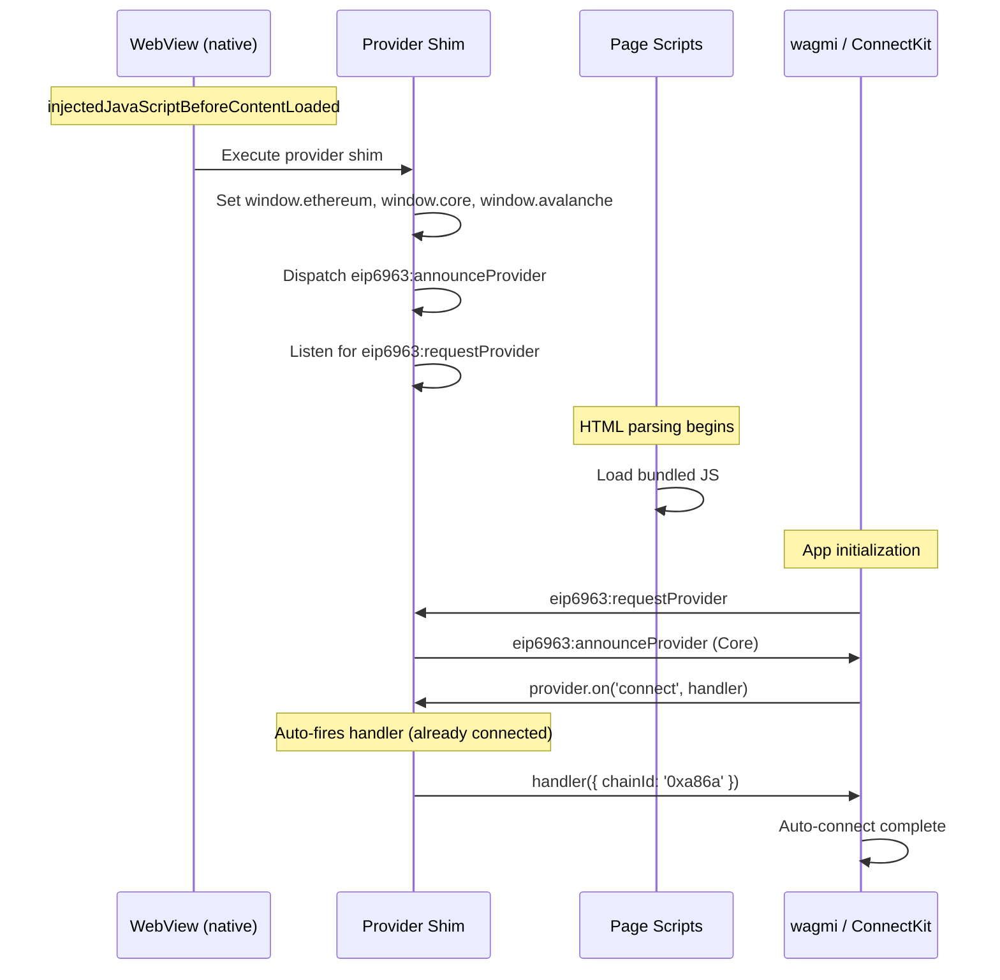
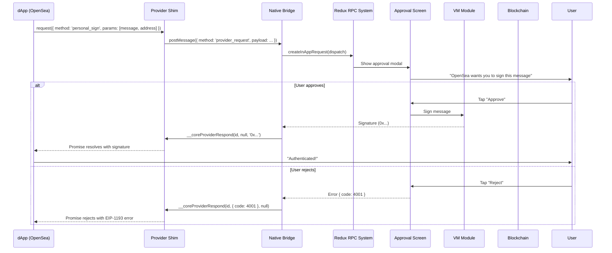
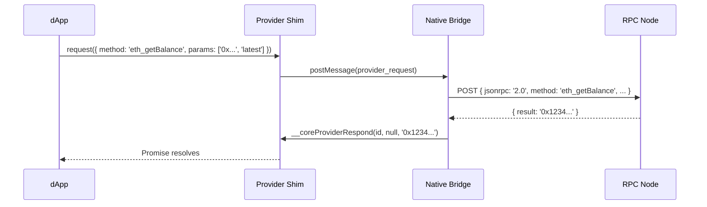
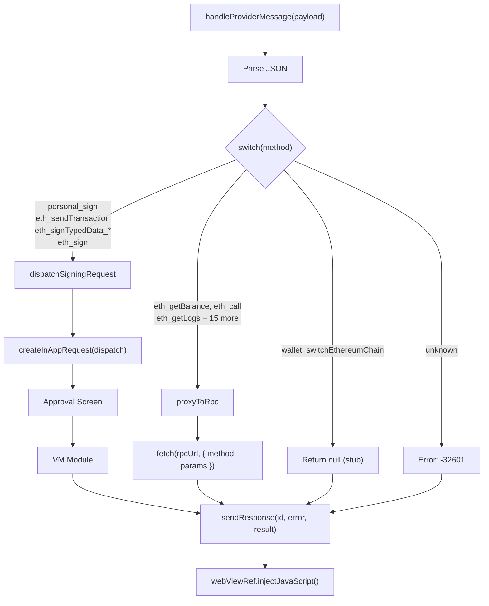
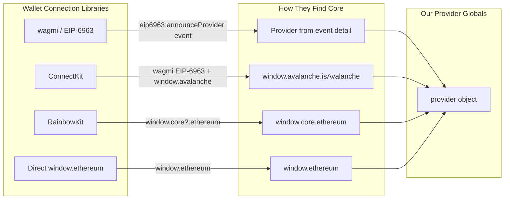

# EVM Injected Provider — Demo Implementation

> **Status:** Working demo (behind hardcoded feature flag)
> **Scope:** EVM chains only (Phase 1)
> **Tested on:** OpenSea, Aave, and other major dApps

---

## Table of Contents

1. [Overview](#1-overview)
2. [Architecture](#2-architecture)
3. [Files Changed](#3-files-changed)
4. [How It Works](#4-how-it-works)
5. [Provider Shim Deep Dive](#5-provider-shim-deep-dive)
6. [Native Bridge Deep Dive](#6-native-bridge-deep-dive)
7. [dApp Compatibility](#7-dapp-compatibility)
8. [What the Demo Covers](#8-what-the-demo-covers)
9. [Known Limitations](#9-known-limitations)

---

## 1. Overview

The in-app browser now injects an EIP-1193 compliant `window.ethereum` provider into every web page, making dApps recognize Core Mobile as an installed wallet — exactly like the Core browser extension does on desktop.

### Before



### After



---

## 2. Architecture

### High-Level Flow



### Three-Tier Method Routing



---

## 3. Files Changed

### New Files

| File | Purpose |
|------|---------|
| `app/hooks/browser/evmProviderShim.ts` | JavaScript string injected into WebView — implements `window.ethereum`, EIP-6963, and all local RPC handling |
| `app/hooks/browser/useEvmInjectedProvider.ts` | React hook — native-side message routing, RPC proxying, and signing dispatch |

### Modified Files

| File | Change |
|------|--------|
| `app/hooks/browser/useInjectedJavascript.ts` | Added `provider_request` and `domain_metadata` to `InjectedJsMessageWrapper` type |
| `app/new/features/browser/components/BrowserTab.tsx` | Integrated `useEvmInjectedProvider`, split JS injection into `beforeContentLoaded` and `afterContentLoaded`, added message routing |
| `app/new/features/browser/components/Webview.tsx` | Added `injectedJavaScriptBeforeContentLoaded` prop support |

---

## 4. How It Works

### Injection Timing



The provider is injected via `injectedJavaScriptBeforeContentLoaded`, which runs **before any page scripts**. This is critical — dApps check for `window.ethereum` during their initialization. If we inject after page load (via `injectedJavaScript`), many dApps will have already decided "no wallet detected" and show install prompts.

### Pre-Connected State

Unlike a browser extension which requires a connection approval step, the mobile in-app browser **pre-connects** the provider with the active account. This means:

- `eth_accounts` returns `['0x...']` immediately (no `eth_requestAccounts` needed)
- `isConnected()` returns `true` from the start
- When wagmi subscribes to `connect` / `accountsChanged` events, the callbacks fire immediately

This design makes sense because the in-app browser **is** the wallet — there's no separate extension the user needs to approve. dApps auto-connect on page load.

### Signing Flow (e.g., OpenSea SIWE)



### Read-Only RPC Proxy



---

## 5. Provider Shim Deep Dive

The provider shim (`evmProviderShim.ts`) is a self-contained JavaScript IIFE that creates `window.ethereum` inside the WebView. Key design decisions:

### Global Provider Installation

Three globals are set to maximize compatibility with different wallet connection libraries:

| Global | Used By | Purpose |
|--------|---------|---------|
| `window.ethereum` | All dApps (EIP-1193 standard) | Primary provider |
| `window.core` | RainbowKit Core connector | Looks for `window.core?.ethereum` |
| `window.avalanche` | ConnectKit, wagmi Core connector | Checks `window.avalanche.isAvalanche` |

All are protected with `Object.defineProperty` to prevent dApp scripts from overwriting them.

### Provider Flags

```javascript
provider.isMetaMask = true    // Many dApps gate features behind this
provider.isCore = true        // Core-specific detection
provider.isAvalanche = true   // ConnectKit/wagmi Core wallet check
```

### Methods Handled Locally (No Bridge Round-Trip)

| Method | Response |
|--------|----------|
| `eth_chainId` | Current hex chain ID |
| `eth_accounts` | Pre-populated account array |
| `eth_requestAccounts` | Same as `eth_accounts` (auto-approve) |
| `net_version` | Numeric chain ID |
| `eth_coinbase` | Primary address |
| `wallet_requestPermissions` | Mock permissions object |
| `wallet_getPermissions` | Same as above |

### Auto-Connect Event Mechanism

When a dApp library (wagmi) subscribes to events:

```javascript
provider.on('connect', handler)     // → handler fires immediately if connected
provider.on('accountsChanged', handler) // → handler fires immediately with accounts
```

This triggers wagmi's internal `onConnect` flow, causing the dApp to recognize the wallet as already connected — no manual "Connect Wallet" click needed.

### EIP-6963 Announcement

```javascript
providerInfo = {
  uuid: 'core-mobile-' + Date.now(),
  name: 'Core',
  icon: 'data:image/svg+xml;base64,...',  // Core logo
  rdns: 'app.core.mobile'
}
```
---

## 6. Native Bridge Deep Dive

The `useEvmInjectedProvider` hook (`useEvmInjectedProvider.ts`) handles all messages that arrive from the WebView.

### Method Routing



### Signing Methods Mapping

| dApp RPC Method | Internal RpcMethod |
|---|---|
| `eth_sendTransaction` | `RpcMethod.ETH_SEND_TRANSACTION` |
| `personal_sign` | `RpcMethod.PERSONAL_SIGN` |
| `eth_sign` | `RpcMethod.ETH_SIGN` |
| `eth_signTypedData` | `RpcMethod.SIGN_TYPED_DATA` |
| `eth_signTypedData_v1` | `RpcMethod.SIGN_TYPED_DATA_V1` |
| `eth_signTypedData_v3` | `RpcMethod.SIGN_TYPED_DATA_V3` |
| `eth_signTypedData_v4` | `RpcMethod.SIGN_TYPED_DATA_V4` |

### Read-Only Methods (18 total)

`eth_blockNumber`, `eth_call`, `eth_estimateGas`, `eth_gasPrice`, `eth_getBalance`, `eth_getBlockByHash`, `eth_getBlockByNumber`, `eth_getCode`, `eth_getLogs`, `eth_getStorageAt`, `eth_getTransactionByHash`, `eth_getTransactionCount`, `eth_getTransactionReceipt`, `eth_maxPriorityFeePerGas`, `eth_feeHistory`, `web3_clientVersion`, `web3_sha3`, `eth_getBlockTransactionCountByHash`, `eth_getBlockTransactionCountByNumber`

---

## 7. dApp Compatibility

### Wallet Connection Libraries

During development, we discovered that different dApps use different wallet connection libraries, each with its own provider detection mechanism:



| Library | Used By | Detection Mechanism | Status |
|---------|---------|---------------------|--------|
| wagmi + EIP-6963 | Most modern dApps | `eip6963:announceProvider` event | Working |
| ConnectKit | Aave | `window.avalanche.isAvalanche` flag | Working (auto-connect) |
| RainbowKit | Various | `window.core?.ethereum` namespace | Working |
| Direct `window.ethereum` | OpenSea, older dApps | `window.ethereum.request()` | Working |

### Tested dApps

| dApp | Library | Connection | Signing | Notes |
|------|---------|------------|---------|-------|
| OpenSea | Direct / EIP-6963 | Working | Working (SIWE `personal_sign`) | Shows approval modal for authentication |
| Aave | ConnectKit + wagmi | Working (auto-connect) | Working | Auto-connects on page load |


---

## 8. What the Demo Covers

### Working Features

- [x] `window.ethereum` injected before page content loads
- [x] EIP-6963 wallet discovery (Core logo + name in wallet pickers)
- [x] Pre-connected state (auto-connect on page load, no manual connection needed)
- [x] `eth_requestAccounts` / `eth_accounts` — returns active account instantly
- [x] `eth_chainId` / `net_version` — returns current chain
- [x] `wallet_requestPermissions` / `wallet_getPermissions` — mock permissions
- [x] Read-only RPC proxying (18 methods)
- [x] Signing methods through approval UI:
  - `personal_sign` (SIWE authentication)
  - `eth_sendTransaction`
  - `eth_signTypedData` (v1, v3, v4)
  - `eth_sign`
- [x] Domain metadata extraction (site name, favicon, URL)
- [x] Injection guards (skip XML, PDF, non-HTML pages)
- [x] `window.core` and `window.avalanche` globals for library compatibility
- [x] Legacy method support (`enable()`, `send()`, `sendAsync()`)
- [x] PostHog Feature flag (`INJECTED_PROVIDER`)

---

## 9. Known Limitations

### No Connection Approval

Currently, every dApp is auto-approved. There is no "Connect to this site?" prompt. The provider returns the active account to any page that asks. For production, we need per-origin connection tracking.

### Chain Switching is Stubbed

`wallet_switchEthereumChain` returns success without actually switching. The dApp believes the chain changed, but the wallet stays on the same network. Need to wire into the actual network switching logic and emit `chainChanged` events.

### No `chainChanged` / `accountsChanged` Events from App

If the user switches their account or network inside the app while a dApp is open, the dApp is not notified. Need to observe Redux state changes and call `emitEvent()`.

### Single Account Only

Only the active EVM account (`addressC`) is exposed. No multi-account selection.

### No `wallet_addEthereumChain`

dApps cannot add custom networks. Requests will fail with "Method not supported."

### No Disconnect Support

`wallet_revokePermissions` is not handled. dApps that try to disconnect will silently fail (wagmi has a timeout for this so it won't hang).