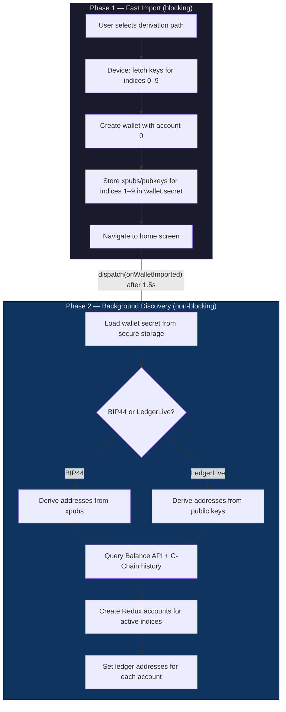
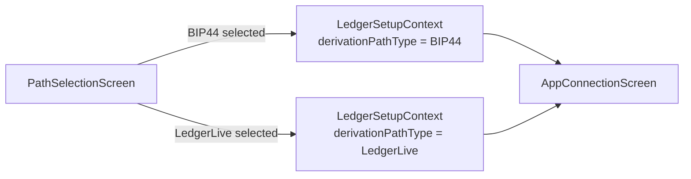
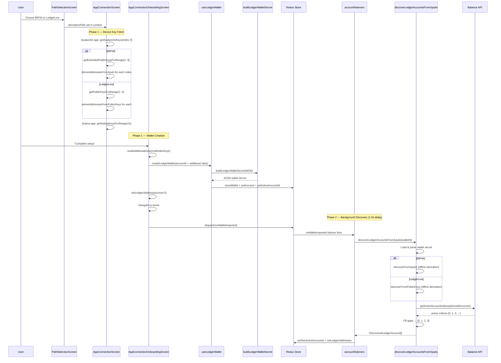
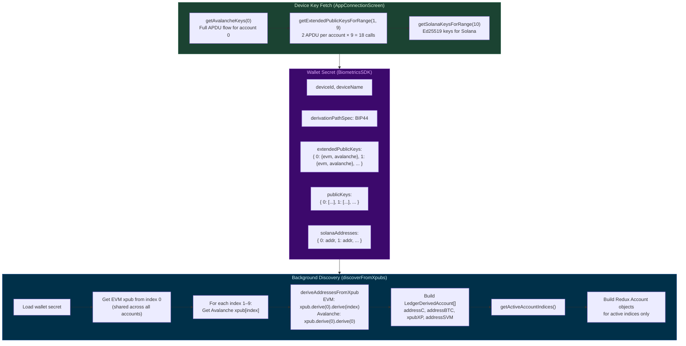
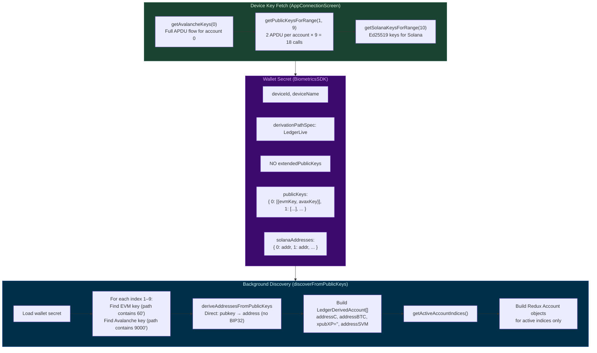
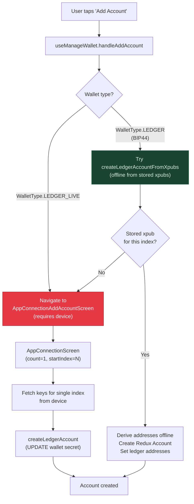
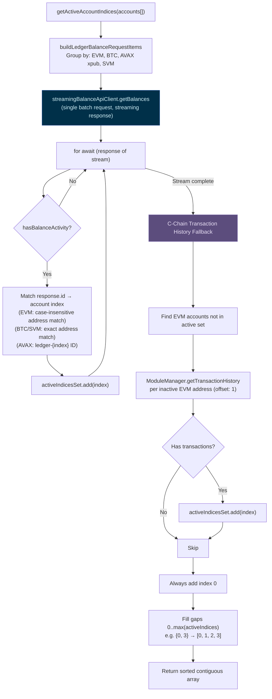
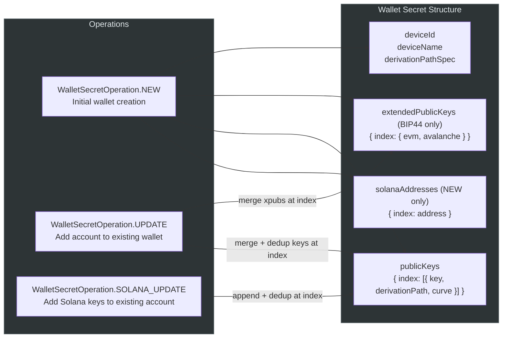

# Ledger Account Discovery Design

This document explains the two Ledger account discovery flows (BIP44 and LedgerLive), when each fires, and how the onboarding / import / add-account paths work end-to-end.

---

## Table of Contents

- [High-Level Architecture](#high-level-architecture)
- [Derivation Path Selection](#derivation-path-selection)
- [Onboarding & Import Flow](#onboarding--import-flow)
- [BIP44 Discovery (Deep Dive)](#bip44-discovery-deep-dive)
- [LedgerLive Discovery (Deep Dive)](#ledgerlive-discovery-deep-dive)
- [Add Account Flow (Post-Onboarding)](#add-account-flow-post-onboarding)
- [Balance Activity Detection](#balance-activity-detection)
- [Key Material Storage](#key-material-storage)
- [File Map](#file-map)

---

## High-Level Architecture

Both BIP44 and LedgerLive follow the same two-phase strategy:

1. **Fast import** — create account 0 on the device, store key material for indices 0–9
2. **Background discovery** — after navigation, derive addresses offline and check on-chain activity to auto-create accounts 1–9



---

## Derivation Path Selection

The user picks their derivation mode on `PathSelectionScreen`. This choice determines how keys are fetched from the device and how addresses are derived offline.



| Property | BIP44 | LedgerLive |
|----------|-------|------------|
| Key type from device | Account-level extended public keys (xpubs) | Address-level raw public keys |
| EVM derivation | Shared xpub at `m/44'/60'/0'`, address at `0/{index}` | Per-account pubkey at `m/44'/60'/{index}'/0/0` |
| Avalanche derivation | Per-account xpub at `m/44'/9000'/{index}'` | Per-account pubkey at `m/44'/9000'/{index}'/0/0` |
| Offline address derivation | `deriveAddressesFromXpub` (BIP32 child derivation) | `deriveAddressesFromPublicKeys` (direct) |
| Stored `extendedPublicKeys` | Yes — per-index `{ evm, avalanche }` | No — omitted from wallet secret |
| Wallet type in Redux | `WalletType.LEDGER` | `WalletType.LEDGER_LIVE` |
| Offline add-account support | Yes (via stored xpubs) | No (requires device connection) |

---

## Onboarding & Import Flow

The same screen components serve both **first-time onboarding** (no existing wallet) and **import** (adding a Ledger to an existing app). The only differences are navigation targets and toast behavior.

| Route | Context |
|-------|---------|
| `routes/onboarding/ledger/appConnection` | First-time onboarding |
| `routes/(signedIn)/(modals)/accountSettings/ledger/appConnection` | Import while signed in |

Both render `AppConnectionOnboardingScreen`.



---

## BIP44 Discovery (Deep Dive)

BIP44 uses **extended public keys** for efficient offline derivation. A single EVM xpub at index 0 can derive EVM addresses for all account indices.



### BIP44 Key Derivation Tree

```
m/44'/60'/0'              ← EVM account-level xpub (shared, fetched once)
├── 0/0                   ← Account 0 EVM address
├── 0/1                   ← Account 1 EVM address
├── 0/2                   ← Account 2 EVM address
└── ...

m/44'/9000'/0'            ← Avalanche xpub for account 0
└── 0/0                   ← Account 0 Avalanche address

m/44'/9000'/1'            ← Avalanche xpub for account 1
└── 0/0                   ← Account 1 Avalanche address

m/44'/501'/0'/0'          ← Solana key for account 0 (Ed25519, no derivation)
m/44'/501'/1'/0'          ← Solana key for account 1
```

---

## LedgerLive Discovery (Deep Dive)

LedgerLive uses **address-level public keys** — no xpubs exist, so each account needs its own key pair fetched from the device. The trade-off is that adding accounts beyond the pre-fetched range always requires the device.



### LedgerLive Key Derivation Paths

```
m/44'/60'/0'/0/0          ← Account 0 EVM pubkey + address
m/44'/60'/1'/0/0          ← Account 1 EVM pubkey + address
m/44'/60'/2'/0/0          ← Account 2 EVM pubkey + address

m/44'/9000'/0'/0/0        ← Account 0 Avalanche pubkey + address
m/44'/9000'/1'/0/0        ← Account 1 Avalanche pubkey + address

m/44'/501'/0'/0'          ← Account 0 Solana (same as BIP44)
```

### Key Difference: No AVAX xpub in Balance Query

Because LedgerLive has no xpubs, `buildLedgerBalanceRequestItems` receives `xpubXP: ''` for LedgerLive accounts. The AVAX X/P-chain balance check is **skipped** (no xpub entry added to the batch). Activity detection relies on EVM, BTC, and SVM addresses only.

---

## Add Account Flow (Post-Onboarding)

After the wallet is created, users can add accounts from the portfolio settings. The flow differs by wallet type:



### BIP44 Offline Fast Path

For BIP44 wallets where xpubs are already stored (indices 0–9 from the initial import), `createLedgerAccountFromXpubs` can derive all addresses **without the Ledger device**:

1. Load wallet secret → parse with `LedgerWalletSecretSchema`
2. Check `derivationPathSpec === BIP44` and xpubs exist for the index
3. Use shared EVM xpub (index 0) + per-account Avalanche xpub
4. `deriveAddressesFromXpub` for mainnet and testnet
5. Create Redux Account — no device, no balance API, instant

### LedgerLive — Always Requires Device

LedgerLive stores raw public keys, not xpubs. New account indices that weren't pre-fetched during import cannot be derived offline. The user must connect their Ledger and navigate through `AppConnectionAddAccountScreen`.

---

## Balance Activity Detection

`getActiveAccountIndices` determines which account indices have on-chain activity. It uses a two-tier approach:



### Balance Activity Types Checked

| Network Type | Activity Sources |
|-------------|-----------------|
| `evm` | Native token balance, ERC-20 token balances |
| `btc` | Native token balance, unconfirmed balance |
| `svm` | Native token balance, SPL token balances |
| `avm` | Native balance, unlocked/locked categories, atomic memory |
| `pvm` | Native balance, staked/unstaked categories, atomic memory |
| `coreth` | Native balance, atomic memory (unlocked + locked) |

### Fallback Strategy

The C-Chain history fallback catches accounts that **had past activity but now have zero balance** (e.g., user moved all funds out). The Balance API only reports current balances, so historical transaction checks fill the gap.

---

## Key Material Storage

All key material is stored via `BiometricsSDK` as a JSON wallet secret, built by `buildLedgerWalletSecret`:



The secret is validated at read time with `LedgerWalletSecretSchema` (Zod), which ensures structural integrity even if the stored JSON was created by a different app version.

---

## File Map

| Area | File | Purpose |
|------|------|---------|
| **Screens** | `screens/PathSelectionScreen.tsx` | User picks BIP44 vs LedgerLive |
| | `screens/AppConnectionScreen.tsx` | Device key fetch (shared between onboarding + add account) |
| | `screens/AppConnectionOnboardingScreen.tsx` | Wallet creation + triggers background discovery |
| | `screens/AppConnectionAddAccountScreen.tsx` | Single account addition (device required) |
| **Hooks** | `hooks/useLedgerWallet.ts` | `createLedgerWallet`, `createLedgerAccount`, `updateSolanaForLedgerWallet` |
| | `hooks/useSetLedgerAddress.ts` | Derives + stores ledger addresses for a given account |
| **Utils** | `utils/index.ts` | `buildLedgerWalletSecret`, `buildKeysFromMultiIndex`, `getFormattedAddresses`, `LedgerWalletSecretSchema` |
| | `utils/discoverLedgerAccounts.ts` | `getActiveAccountIndices`, `buildLedgerBalanceRequestItems`, `hasBalanceActivity` |
| | `utils/discoverLedgerAccountsFromXpubs.ts` | Background discovery entry point: `discoverFromXpubs` (BIP44) / `discoverFromPublicKeys` (LedgerLive) |
| | `utils/createLedgerAccountFromXpubs.ts` | BIP44-only offline account creation |
| **Services** | `services/ledger/LedgerService.ts` | Device APDU communication |
| | `services/ledger/deriveAddressesOffline.ts` | `deriveAddressesFromXpub`, `deriveAddressesFromPublicKeys` |
| | `services/ledger/types.ts` | `LedgerDerivationPathType`, `WalletSecretOperation`, `WalletSecretParams`, `LedgerMultiIndexKeys` |
| **Store** | `store/account/listeners.ts` | `onWalletImported` listener → `migrateLedgerActiveAccounts` |
| | `store/app/slice.ts` | `onWalletImported` action creator |
| **Integration** | `common/hooks/useManageWallet.ts` | Portfolio "Add Account" → offline or device flow |
