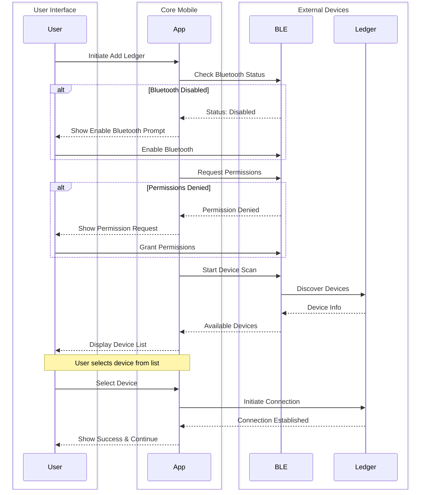
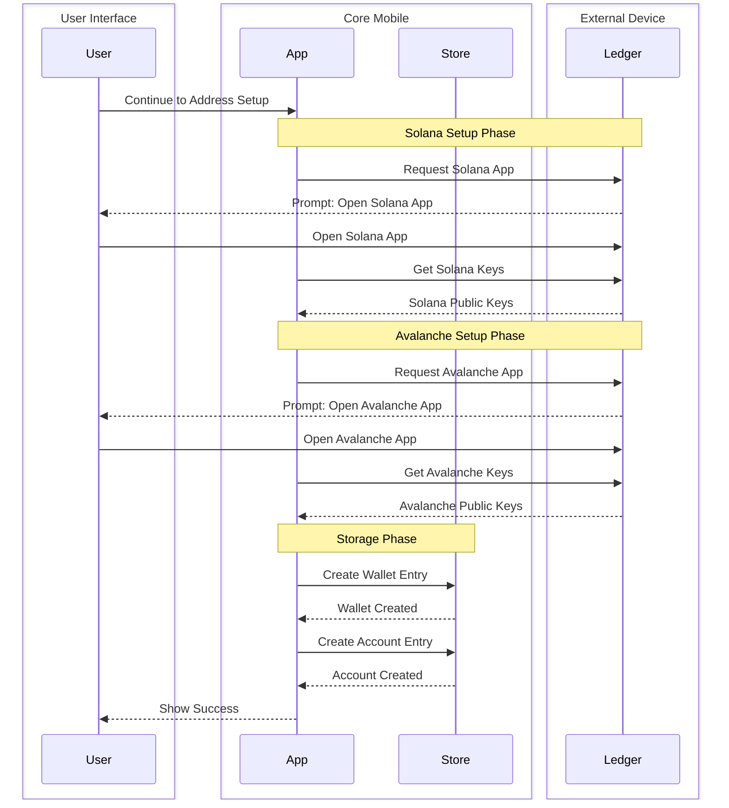
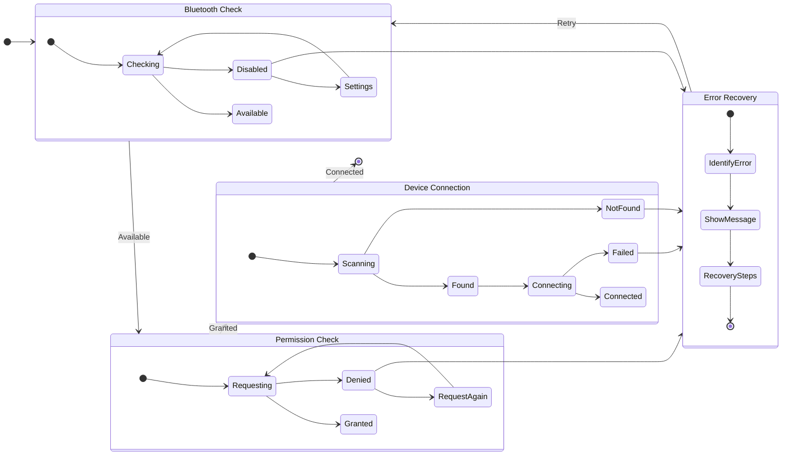

# Ledger Connection Flow

This document describes the current implementation of Ledger device connection and account setup in Core Mobile.

## Device Discovery and Connection

### Flow Diagram

## Account Setup Flow

### Flow Diagram

## Error Handling

### Flow Diagram

### Error Types and Handling

1. **Bluetooth Errors**
- Bluetooth unavailable
- Bluetooth disabled
- Permission denied

2. **Connection Errors**
- Device not found
- Connection timeout
- Pairing removed
- Connection lost

3. **App Errors**
- App not open
- Wrong app open
- App version mismatch

Each error type has specific handling and user messaging to guide through recovery steps.