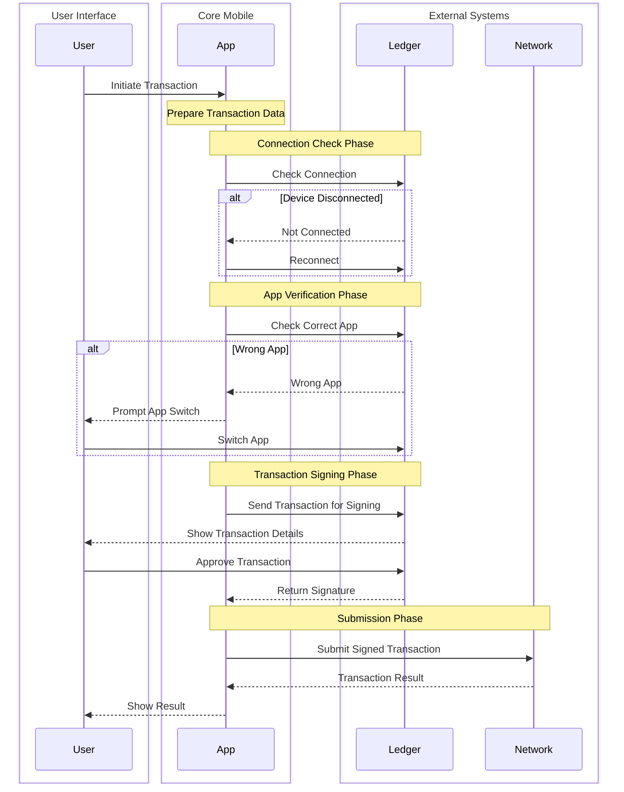
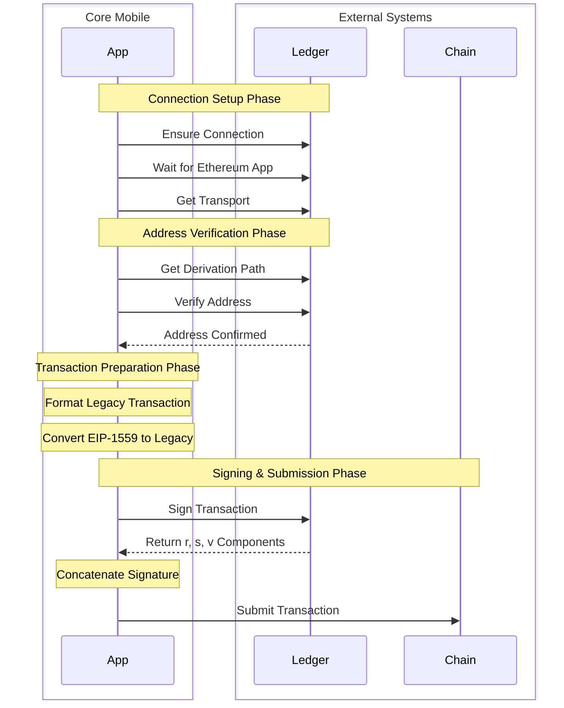
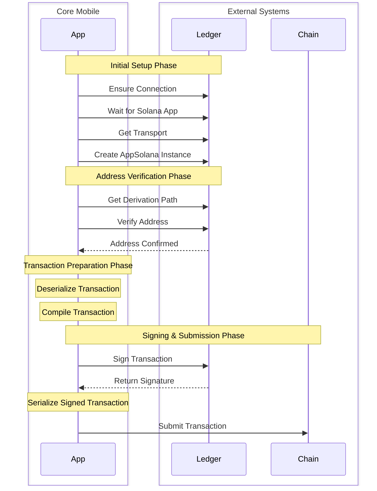
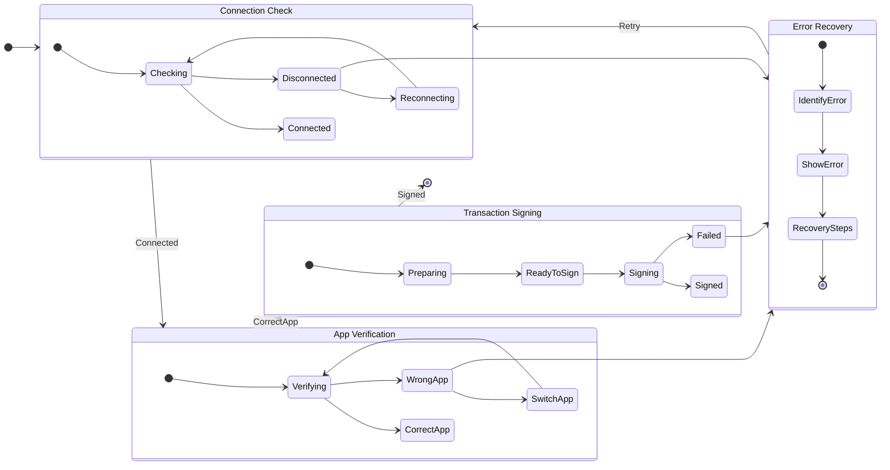

# Ledger Transaction Signing Flow

This document describes the current implementation of Ledger transaction signing in Core Mobile.

## Transaction Signing Overview

### Flow Diagram

## Chain-Specific Implementations

### EVM Transaction Signing

### Solana Transaction Signing

## Error Handling

### Flow Diagram

### Error Types

1. **Connection Errors**
- Device disconnected
- Connection timeout
- Transport error

2. **App Errors**
- Wrong app open
- App not responding
- Version mismatch

3. **Transaction Errors**
- Invalid format
- Preparation failed
- Signing failed
- Processing failed

4. **Validation Errors**
- Address mismatch
- Chain mismatch
- Parameter validation

Each error type includes specific error messages and recovery steps to guide users through the process.