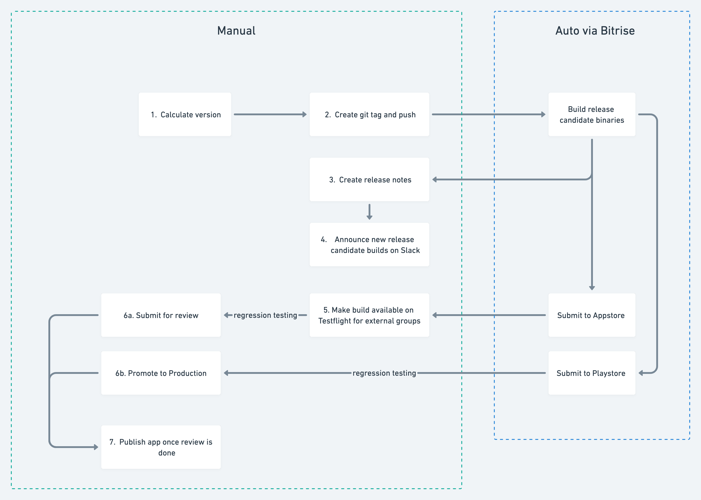
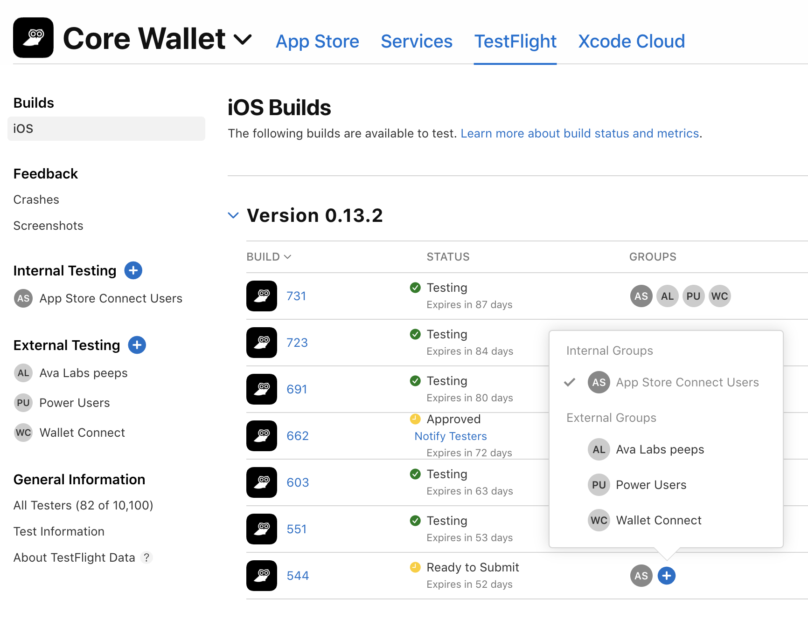
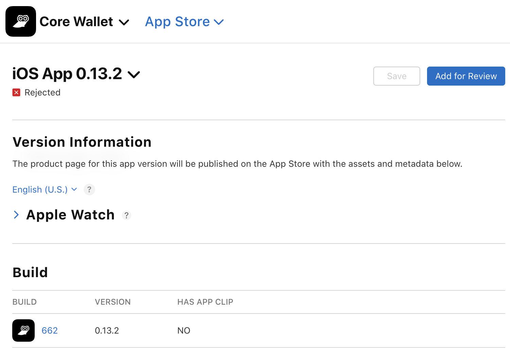
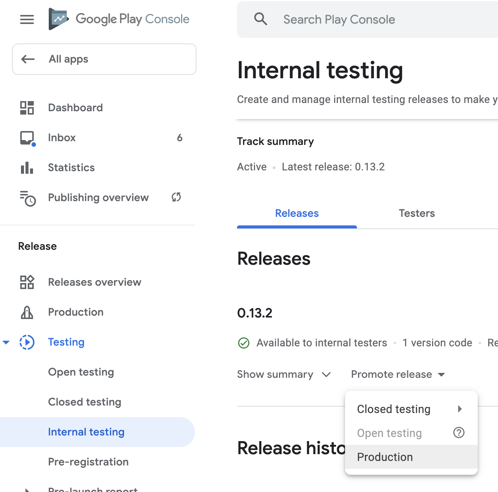

# Release Process



### 1. Calculate next version
- We follow [calver](https://calver.org/). 
- The minor version is bumped when the patch version reaches 99 (same for the major/minor pair).
- The patch version is bumped whenever Apple approves a submitted version.
- If Apple hasn't approved, the version will stay the same.
- For GooglePlay we are not concerned about this because submitted versions are almost never rejected.

- Example 1: 
We submit build #1 with version `0.13.1` to Apple for review on Monday. On Tuesday, we generate and resubmit build #2 (with some bug fixes). The version will still be `0.13.1` since Apple hasn't approved build #1. On Wednesday, Apple approves build #2. The next build to submit to Apple will be `0.13.2`.

Example 2:
Same as example 1 except build #1 has version `0.13.99`. After Apple has approved, the next build to submit to Apple will be `0.14.0`.

### 2. Create a git tag
- Tag format: `[version]-[rcNumber]`
- After calculating the next version, you will need to create a tag off of `develop` branch with that version.
- If there is no existing tag with that version, the `rcNumber` will be `rc1`. If there is, the rcNumber will be the latest one incremented by 1.

Example: Given calculated version is `0.13.2` and there is an existing tag `0.13.2-rc2`, the next tag will be `0.13.2-rc3`

### 3. Create release notes
- Go to https://github.com/ava-labs/avalanche-wallet-apps/releases/new
- Choose the tag you just created in step 2
- Choose a previous tag to compare
- Click "generate release notes"
- Add this to the very top of the generated text. Make sure the versions reflect the newly generated builds.
```
## Build Versions
iOS: **0.13.2.731**
Android: **0.13.2.732**
```

### 4. Announce new release candidates
Post a message in the [`#team-core-browext-mobile`](https://avalancheavax.slack.com/archives/C028N8UEWEN) slack channel announcing the new builds as well as the release notes

### 5. Make build available on Testflight (iOS only)
- Builds will be sent to internal groups on Testflight automatically. However, for external groups, we have to manually do it. 
- On [testflight](https://appstoreconnect.apple.com/apps/6443685999/testflight/ios), select the build you want to make available to external groups. 
- Then, click the plus button and select all the applicable groups.
- If it asks for release notes, feel free to either provide a simplified one based on the github release notes or ask for help from products 



### 6. Submit for review

Notes: This step should only be done after products and QA give the greenlight

On Appstore:
- select the correct build in the **Build** section
- click "Add for Review"



On Playstore:
- Go to internal testing track
- Find the latest release
- Click "Promote release" -> "Production" 

Note: ["Managed publishing"](https://support.google.com/googleplay/android-developer/answer/9859654) is turned on so it **won't** be published upon successful review.



### 7. Publish app 
- Once Apple/Google has finished the review process, we can now publish the app
- On Appstore, click "Release this version" button
- On Playstore, the publish button is in the **Publishing overview** section

