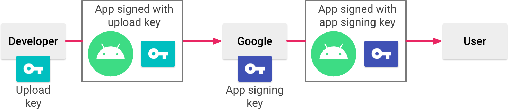

# App Signing

All app signings happen on Bitrise, our CD platform.

## Android

### The flow:
1/ Bitrise builds and signs app bundles with an upload key

2/ Bitrise sends app bundles to Google

3/ Google then signs the app bundles on their server with an app signing key.

### How were they generated?
- The app signing key: generated by Google
- The upload key: generated by us via Android Studio/keytool

### Where do they live?
- The app signing key: is managed by Google and is kept on a secure server
- The upload key: lives in 1password’s Mobile team vault and Bitrise

### Who has access?
- The app signing key: not accessible
- The upload key: anyone who has access to the Mobile team vault on 1password and admin access to Bitrise

## iOS

iOS is a bit different than Android. There are certificates and provisioning profiles. Certificates are the actual signatures. They are an encrypted file that contains a public-private key pair. Provisioning profiles are special files that contain which App ID will use which certificate, and the devices that can install the apps created using this file.

### The flow:
1/ Bitrise downloads and installs the provisioning profiles using AppStore API

2/ Bitrise builds and signs IPAs with the distribution certificate + distribution provisioning profile

3/ Bitrise sends the signed IPAs to Apple

### How were they generated?
- Distribution certificate: generated by us via Appstore Developer Portal
- Distribution provisioning profile: generated for us by Bitrise via AppStore API

### Where do they live?
- Distribution certificate: Appstore Developer Portal and Bitrise
- Distribution provisioning profile: Appstore Developer Portal

### Who has access?
- Distribution certificate: anyone who has dev/admin access to Appstore Developer Portal and admin access to Bitrise
- Distribution provisioning profile: anyone who has dev/admin access to Appstore Developer Portal 

Notes: All the certs/keys that live on Bitrise are protected. You can't see/download them. Can only delete/replace.

