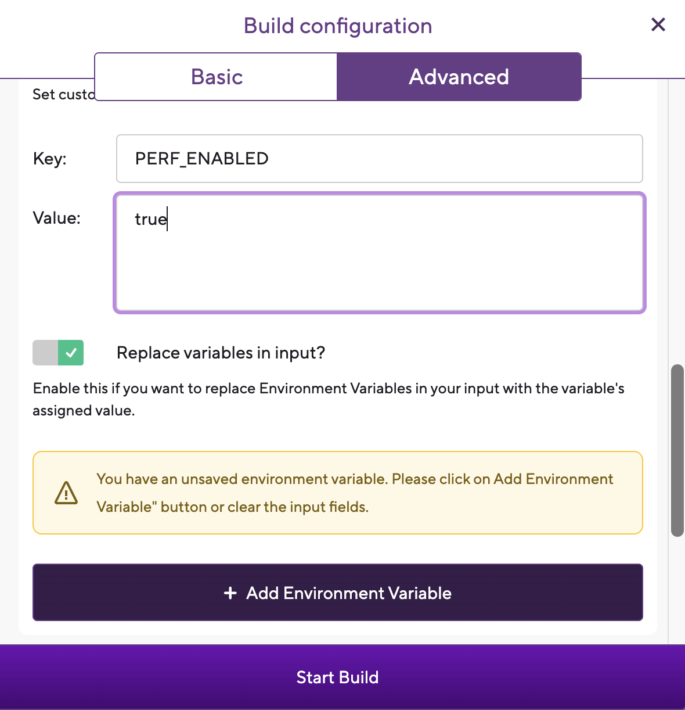

# Performance Testing

## React Native Tools
https://docs.google.com/document/d/1S4D617ojrZWPcabyGiW4qBahUrZ-O1ZxF4org6aadqE/edit

## Native Tools
Android Studio Profiler

Xcode Instruments

## Release Build Testing
To have Flipper as well as the above React Native tools enabled for release builds, the env var PERF_ENABLED must be set to true

On Bitrise, this can be achieved by manually adding the env var when triggering a build

