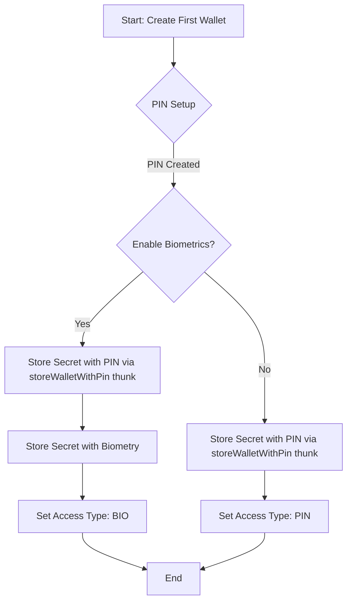
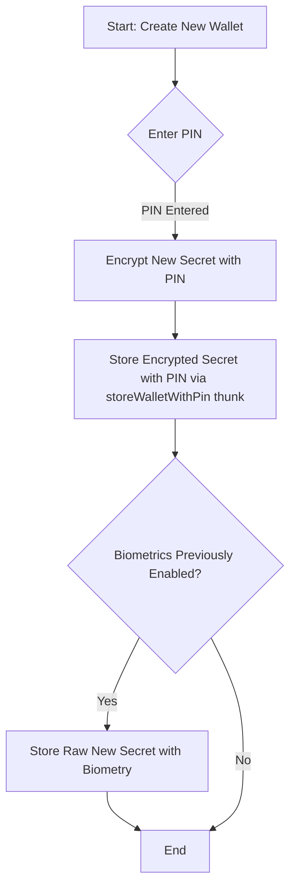
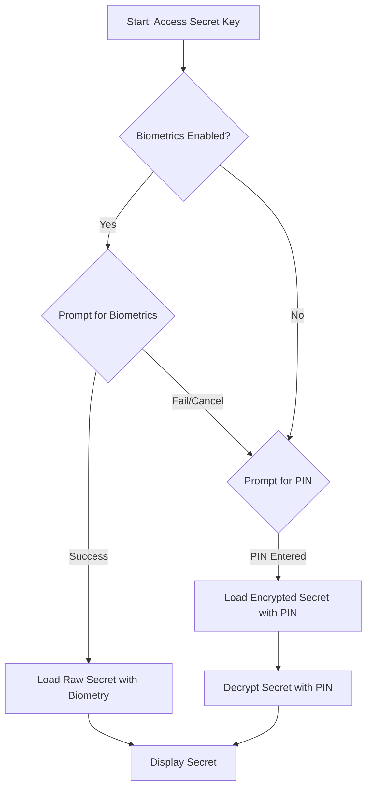

# Secret Key Management

This document outlines how wallet secret keys (typically mnemonics or private keys) are stored and retrieved within the application. We leverage the `BiometricsSDK` to securely store secrets using either a user-defined PIN or device biometrics (like Face ID or Touch ID).

## Storage Mechanisms

There are two primary ways a secret key is stored:

1.  **PIN-based Storage**:

    - The user provides a PIN.
    - This PIN is used to encrypt the secret key.
    - The encrypted secret is then stored in the device's secure keychain.
    - This method is always used as a primary or fallback mechanism.

2.  **Biometric-based Storage**:
    - If the user enables biometric authentication, the raw (unencrypted) secret key is stored directly in a secure enclave, protected by the device's biometric hardware.
    - This is considered secure enough not to require an additional layer of PIN-based encryption on the secret itself.
    - The `BiometricsSDK` handles the interaction with the native keychain services, using specific service keys:
      - For PIN-based storage: `SERVICE_KEY-<walletId>`
      - For biometric storage: `SERVICE_KEY_BIO-<walletId>`

## Wallet Creation and Key Storage Flows

### 1. First Wallet Creation

When a user creates their very first wallet:

1.  **PIN Setup (Required)**: The user is prompted to create a PIN.
    - The wallet's secret key is encrypted using this PIN.
    - The encrypted secret is stored via `BiometricsSDK.storeWalletWithPin` using a service key like `SERVICE_KEY-<walletId>`. This step is orchestrated by the `storeWalletWithPin` thunk.
2.  **Biometric Setup (Optional)**: The user is asked if they want to enable biometric authentication.
    - **If Yes**:
      - The raw secret key is stored using `BiometricsSDK.storeWalletWithBiometry` under a service key like `SERVICE_KEY_BIO-<walletId>`.
      - The application records that biometric authentication is enabled (e.g., by setting `StorageKey.SECURE_ACCESS_SET` to 'BIO').
    - **If No**:
      - Only PIN-based storage is used.
      - The application records that PIN authentication is the chosen method (e.g., by setting `StorageKey.SECURE_ACCESS_SET` to 'PIN').

### 2. Subsequent Wallet Creation

When a user already has one or more wallets and decides to create another one (e.g., importing a new mnemonic or private key):

1.  **PIN Prompt (Required)**: The user is always prompted for their existing PIN.
    - The new wallet's secret key is encrypted using this PIN.
    - The encrypted secret is stored via `BiometricsSDK.storeWalletWithPin`, orchestrated by the `storeWalletWithPin` thunk.
2.  **Biometric Check (Automatic)**: The application checks if biometric authentication was previously enabled (`StorageKey.SECURE_ACCESS_SET === 'BIO'`).
    - **If Yes**:
      - The new wallet's raw secret key is automatically stored using `BiometricsSDK.storeWalletWithBiometry` without an explicit user prompt for biometrics during this specific flow.
    - **If No**:
      - Only PIN-based storage is used for this new wallet.

### 3. Accessing/Loading Wallet Secret Key

When the user needs to access their stored secret key (e.g., to view their mnemonic phrase):

1.  **Authentication Prompt**: The application determines the available authentication methods. The UI for this prompt is typically handled by components like `packages/core-mobile/app/new/common/components/VerifyWithPinOrBiometry.tsx`.
    - If biometrics are enabled (`StorageKey.SECURE_ACCESS_SET === 'BIO'`), the user is prompted for biometrics. If successful, the raw secret is loaded via `BiometricsSDK.loadWalletKey` (using biometric-specific options).
    - If biometrics fail or are not enabled, the user is prompted to enter their PIN.
    - If the PIN is entered, it's used to decrypt the secret loaded via `BiometricsSDK.loadWalletWithPin`.

## Key Files Involved

- `packages/core-mobile/app/utils/BiometricsSDK.ts`: Provides the core abstraction layer for interacting with the device's keychain to store and retrieve secrets using PIN or biometrics. It defines specific keychain service names and configurations.
- `packages/core-mobile/app/store/wallet/thunks.ts`: Contains Redux thunks that orchestrate the higher-level logic for wallet creation, import, and loading, utilizing `BiometricsSDK.ts` for the secure storage operations.
  - The `importMnemonicWalletAndAccount` thunk is a key example of these flows.
  - The `storeWalletWithPin` thunk is responsible for storing the wallet with PIN encryption. It takes `walletId`, `walletSecret`, `isResetting` (boolean), and `type` as parameters. On successful completion, the wallet is also automatically updated in the Redux store.
- `packages/core-mobile/app/new/common/components/VerifyWithPinOrBiometry.tsx`: A UI component responsible for prompting the user for PIN or biometric authentication when accessing sensitive wallet operations or data.

## Important Considerations

- **PIN as Encryption Key**: When biometrics are not used or as a fallback, the PIN itself is the key to encrypting and decrypting the wallet secret.
- **Biometrics for Direct Access**: When biometrics are enabled, the system relies on the device's secure hardware to protect the raw secret, allowing direct storage and retrieval without PIN-based encryption for that specific storage entry.
- **Service Keys**: `BiometricsSDK` uses distinct service identifiers in the keychain for PIN-protected secrets (`SERVICE_KEY-<walletId>`) and biometrically-protected secrets (`SERVICE_KEY_BIO-<walletId>`). This allows both methods to coexist for a single wallet if needed.
- **Fallback to Device Passcode**: If storing with biometry initially fails, `BiometricsSDK` attempts a fallback to store the secret using the device passcode as a security measure.
