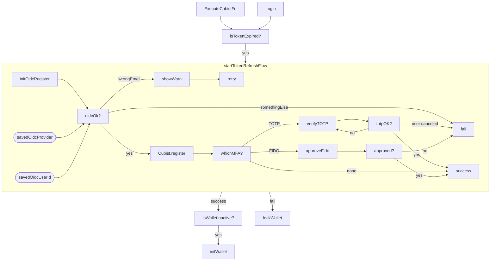

# Token refresh flow

Seedless token has expiration time and Cubist-SDK does the best it can to keep token fresh.
However, for number of reasons token may not refresh and be in stale state which is notified to app
by global event which we catch with

```ts
GlobalEvents.onSessionExpired(onSessionExpiredHandler)
```

Following diagram shows flow of handling various states:

